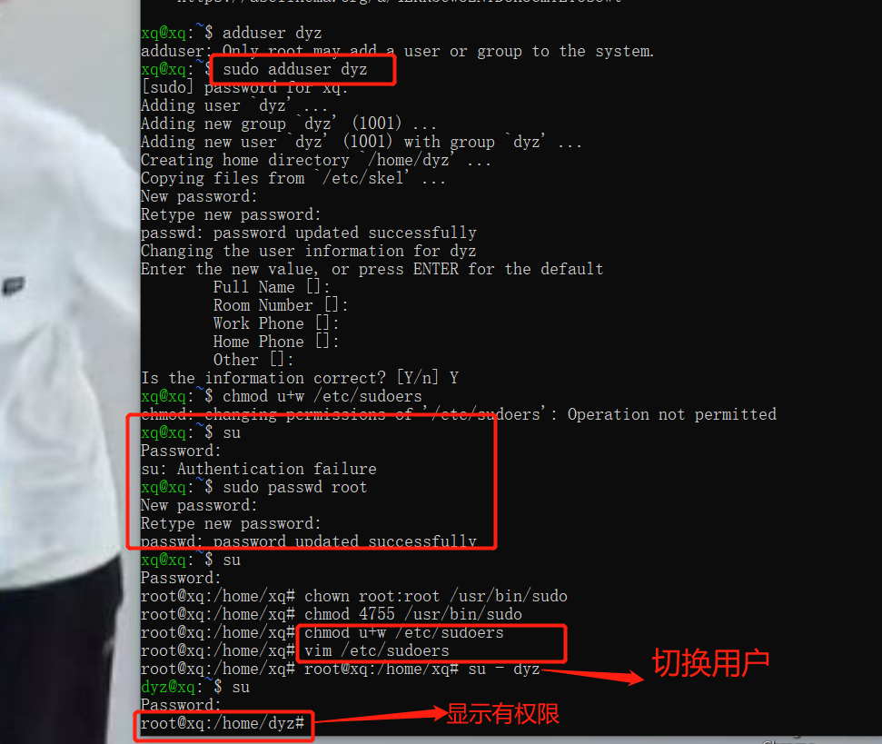
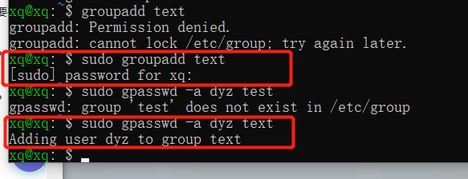
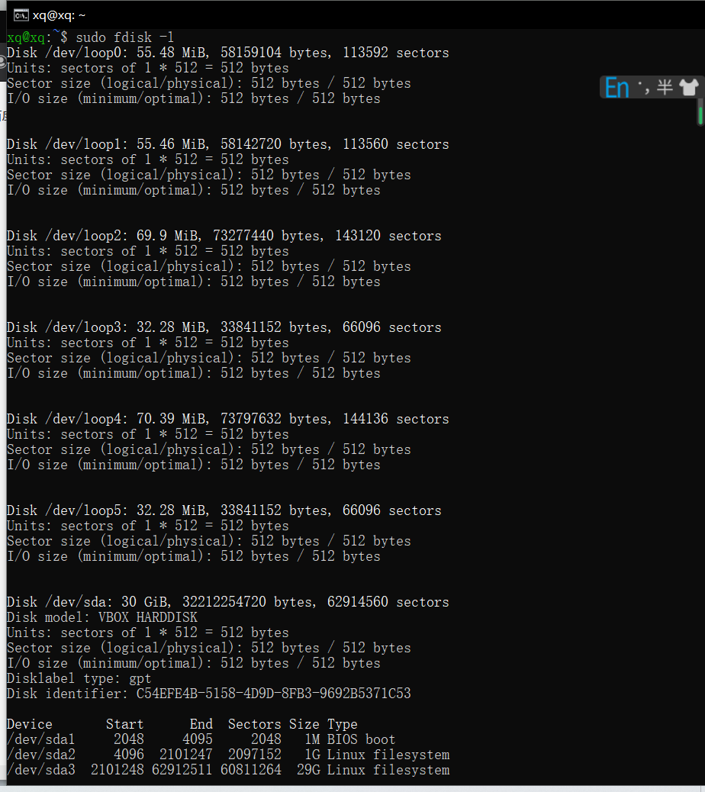
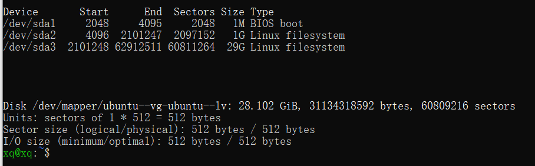
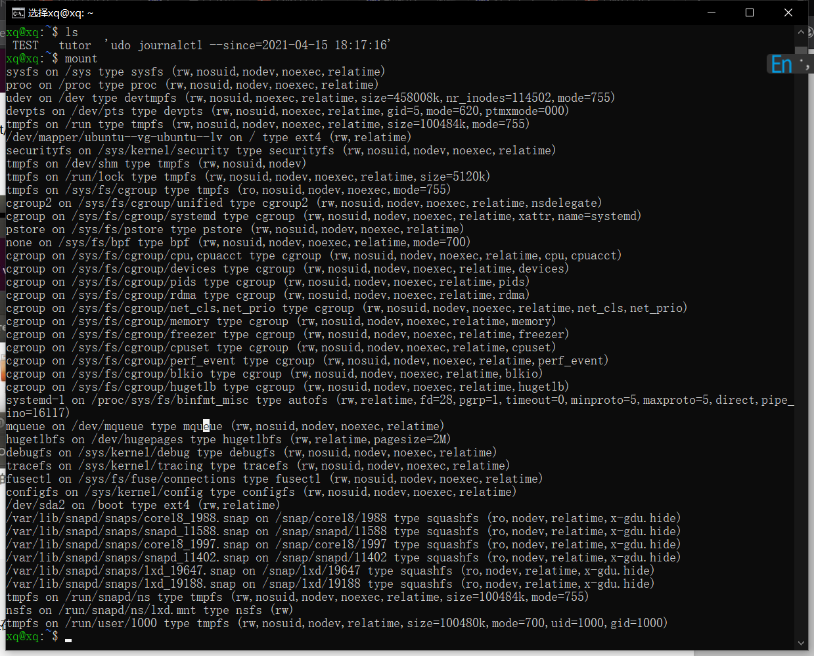
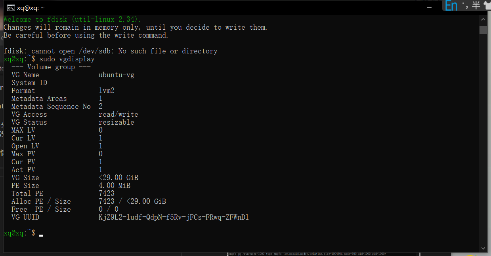

# 第三次实验 #

- 实验目的：

  熟悉system的操作

- 实验内容：

  （1）命令篇：

  

  - 注释：3.1：操作之后都显示断开连接；录屏省略了3.1的操作；

  - - - 

  

  - - - 

  

  - - -

  

  - - - 

  

  - - - 

  （2）实战篇：

  

  - - - 

  

  - - - 

  课后自查清单：

- 添加一个用户并使其具备sudo执行程序的权限：

  

  - 如图圈起来所示；

- 将一个用户添加到一个用户组：

  

- 查看当前系统的分区表和文件系统详细信息：

  

  

- 实现开机自动挂载Virtualbox的共享目录分区:
  操作：

  （1）设置共享文件夹share（在d盘），

  （2）然后在root权限下输入 vi /etc/rc.local；

  （3）然后编辑文件，在文件中加入：mount -t vboxsf sharing /mnt/（共享文件名文件名） ；

  （4）然后输入reboot重启系统，

  （5）输入mount得到挂载信息；

  
- 基于LVM（逻辑分卷管理）的分区实现动态扩容和缩减容量：  

  （1）查看磁盘情况：sudo fdisk -l；

  （2）查看卷组详情：sudo vgdisplay；
  

  （3）增容30g： sudo lvextend -L 30G /dev/mapper/ubuntu--vg-ubuntu--lv

  （4）重新加载扩容后的情况：sudo resize2fs /dev/mapper/ubuntu--vg-ubuntu--lv

  （5）再查看：sudo fdisk -l

- 通过systemd设置实现在网络连通时运行一个指定脚本，在网络断开时运行另一个脚本：

  //修改
  [service]
  Restart=always
  sudo systemctl daemon-reload

  
### 遇到的问题解决参考 （标题即遇到的报错）
https://blog.csdn.net/michaelzhou224/article/details/17683173

https://blog.csdn.net/xyw_blog/article/details/12997707

https://blog.csdn.net/qq_40511918/article/details/83650536