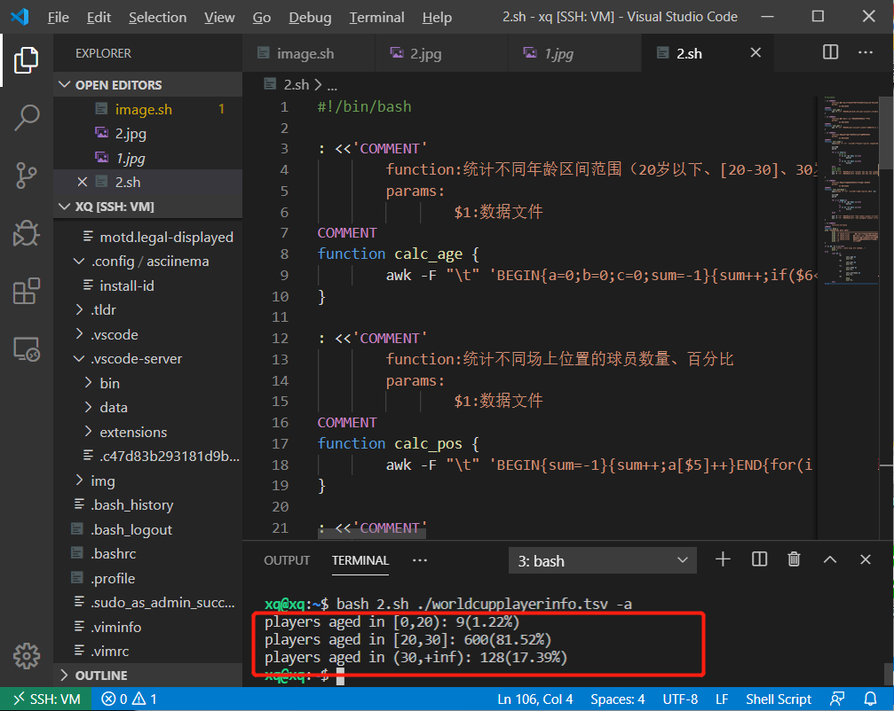

# 第四次实验
- 实验目的：熟悉shell 脚本编程
- 实验环境：
    - Ubuntu20.04
    - vbox
## 实验任务：
- 任务一：用bash编写一个图片批处理脚本，实现以下功能：
    - [x] 支持命令行参数方式使用不同功能 
    - [x] 支持对指定目录下所有支持格式的图片文件进行批处理指定目录进行批处理
    - [x] 支持以下常见图片批处理功能的单独使用或组合使用
        - [x] 支持对jpeg格式图片进行图片质量压缩
        - [x] 支持对jpeg/png/svg格式图片在保持原始宽高比的前提下压缩分辨率
        - [x] 支持对图片批量添加自定义文本水印
        - [x] 支持批量重命名（统一添加文件名前缀或后缀，不影响原始文件扩展名）
        - [x] 支持将png/svg图片统一转换为jpg格式
- 任务二：
    - 用bash编写一个文本批处理脚本，对以下附件分别进行批处理完成相应的数据统计任务；
        - 2014世界杯运动员数据
            - [x] 统计不同年龄区间范围（20岁以下、[20-30]、30岁以上）的球员数量、百分比
            - [x] 统计不同场上位置的球员数量、百分比
            - [x] 名字最长的球员是谁？名字最短的球员是谁？
            - [x] 年龄最大的球员是谁？年龄最小的球员是谁？
- 任务三：
    - 用bash编写一个文本批处理脚本，对以下附件分别进行批量处理完成相应的数据统计任务：
        - web服务器访问日志
            -  统计访问来源主机TOP 100和分别对应出现的总次数
            -  统计访问来源主机TOP 100 IP和分别对应出现的总次数
            -  统计最频繁被访问的URL TOP 100
            -  统计不同响应状态码的出现次数和对应百分比
            -  分别统计不同4XX状态码对应的TOP 10 URL和对应出现的总次数
            -  给定URL输出TOP 100访问来源主机
## 实验过程：
- 1，用vscode连接虚拟机：
    - 参照步骤：https://www.cnblogs.com/hi3254014978/p/12681594.html
    - 出现问题解决：https://www.jb51.net/article/197324.htm

- 安装imagemagick：
```sudo apt-get update && sudo apt-get install imagemagick ```
- 下载数据文件1：
```  wget "https://c4pr1c3.gitee.io/linuxsysadmin/exp/chap0x04/worldcupplayerinfo.tsv" ```
- 下载数据文件2：
```wget "https://c4pr1c3.gitee.io/linuxsysadmin/exp/chap0x04/web_log.tsv.7z"```

- 报错：--2021-05-04 22:24:52--  https://c4pr1c3.gitee.io/linuxsysadmin/exp/chap0x04/web_log.tsv.7z
Resolving c4pr1c3.gitee.io (c4pr1c3.gitee.io)... 212.64.62.183
Connecting to c4pr1c3.gitee.io (c4pr1c3.gitee.io)|212.64.62.183|:443... connected.
HTTP request sent, awaiting response... 404 Not Found
2021-05-04 22:24:52 ERROR 404: Not Found.

- （这是最后一天的报错，之前也是这个样子）

- 检查网页：

    
- task1：

    ```bash image.sh ./img -h```
    

    ```bash image.sh ./img -a 75%```
    
    

    ```bash image.sh ./img -b 75%```
    
    

    ```bash image.sh ./img -m "watermark"```
    
    

    ```bash image.sh ./img -p "re_"```
    

    ``` bash image.sh ./img -t```
    
- task2:

    ```bash 2.sh ./worldcupplayerinfo.tsv -h```
    

    ```bash 2.sh ./worldcupplayerinfo.tsv -a```
    

    ```bash 2.sh ./worldcupplayerinfo.tsv -b```
    

    ```bash 2.sh ./worldcupplayerinfo.tsv -c```
    

    ```bash 2.sh ./worldcupplayerinfo.tsv -d```
    

- task3:

    bash 3.sh ./web_log.tsv -h

    bash 3.sh ./web_log.tsv -a

    bash 3.sh ./web_log.tsv -b

    bash 3.sh ./web_log.tsv -c

    bash 3.sh ./web_log.tsv -d

    bash 3.sh ./web_log.tsv -e

    bash 3.sh ./web_log.tsv -f
 - - - 
 image.sh文件：
```    #!/bin/bash
: <<'COMMENT'
        function:对jpeg格式图片进行图片质量压缩
        params:
                $1:压缩百分比
COMMENT
function image_compress_quality {
        for img in `ls`;do
                type=${img##*.}
                if [[ $type == "jpeg" ]];then
                        convert $img -quality $1 $img
                        echo "$img is successfully compressed of quality $1"
                fi
        done
}

: <<'COMMENT'
        function:对jpeg/png/svg格式图片在保持原始宽高比的前提下压缩分辨率
        params:
                $1:压缩百分比
COMMENTw
function image_compress_resolution {
        for img in `ls`;do
                type=${img##*.}
                if [[ $type == "jpeg"||$type == "png"||$type == "svg" ]];then
                        convert $img -resize $1 $img
                        echo "$img is successfully compressed of resolution $1"
                fi
        done
}

: <<'COMMENT'
        function:对图片批量添加自定义文本水印
        params:
                $1:水印文本
COMMENT
function add_watermark {
        for img in `ls`;do
                mogrify -pointsize 16 -fill black -weight bolder -gravity southeast -annotate +5+5 $1 $img
                echo "watermark is successfully added on $img"
        done
}

: <<'COMMENT'
        function:统一添加文件名前缀
        params:
                $1:文件名前缀
COMMENT
function add_prefix {
        for img in `ls`;do
                mv $img $1$img
                echo "$img is renamed as $1$img"
        done
}

: <<'COMMENT'
        function:统一添加文件名后缀
        params：
                $1:文件名后缀
COMMENT
function add_suffix {
        for img in `ls`;do
                mv $img $img$1
                echo "$img is renamed as $img$1"
        done
}

: <<'COMMENT'
        function:将png/svg图片统一转换为jpg格式图片
COMMENT
function image_transform {
        for img in `ls`;do
                type=${img##*.}
                if [[ $type == "png"||$type == "svg" ]];then
                        convert $img ${img%%.*}.jpg
                        echo "$img is successfully converted to ${img%%.*}.jpg"
                fi
        done
}

: <<'COMMENT'
        function:帮助信息
COMMENT
function help {
        echo "PARAMETERS HELP INFO:"
        echo ":=======================================================================================:"
        echo "-a [quality_args]                 对jpeg格式图片进行图片质量压缩"
        echo "-b [resolution_args]              对jpeg/png/svg格式图片在保持原始宽高比的前提下压缩分辨率"
        echo "-m [watermark_text]               批量添加自定义文本水印"
        echo "-p [prefix_info]          统一添加文件名前缀"
        echo "-s [suffix__info]         统一添加文件名后缀"
        echo "-t                                将png/svg图片统一转换为jpg格式图片"
        echo "-h                                帮助文档"
}


if [[ $# -lt 1 ]];then
        echo "error...more args are needed..."
        exit 1
else
        array=($@)
        i=0
        while [[ $i -lt $# ]];do
                if [[ ${array[$i]} == $1 ]];then
                        cd $1
                        #ls -l
                else
                        case ${array[$i]} in
                                -a)
                                        image_compress_quality ${array[$((i+1))]};;
                                -b)
                                        image_compress_resolution ${array[$((i+1))]};;
                                -m)
                                        add_watermark ${array[$((i+1))]};;
                                -p)
                                        add_prefix ${array[$((i+1))]};;
                                -s)
                                        add_suffix ${array[$((i+1))]};;
                                -t)
                                        image_transform;;
                                -h)
                                        help;;
                        esac
                fi
                i=$((i+1))
                #echo ${array[$((i+1))]}
        done
        exit 0
fi
```
2.sh文件：
```
#!/bin/bash

: <<'COMMENT'
        function:统计不同年龄区间范围（20岁以下、[20-30]、30岁以上）的球员数量、百分比
        params:
                $1:数据文件
COMMENT
function calc_age {
        awk -F "\t" 'BEGIN{a=0;b=0;c=0;sum=-1}{sum++;if($6<20){a++} else if($6>=20&&$6<=30){b++} else{c++}}END{printf "players aged in [0,20): %d(%.2f%%)\nplayers aged in [20,30]: %d(%.2f%%)\nplayers aged in (30,+inf): %d(%.2f%%)\n",a,a*100/sum,b,b*100/sum,c,c*100/sum}' $1
}

: <<'COMMENT'
        function:统计不同场上位置的球员数量、百分比
        params:
                $1:数据文件
COMMENT
function calc_pos {
        awk -F "\t" 'BEGIN{sum=-1}{sum++;a[$5]++}END{for(i in a){if(i!="Position"){printf "players of %s: %d(%.4f%%)\n",i,a[i],a[i]*100/sum}}}' $1
}

: <<'COMMENT'
        function:得到名字最长的球员与名字最短的球员
        params:
                $1:数据文件
COMMENT
function calc_name {
        len=$(awk -F "\t" '{if($9!="Player"){print length($9)}}' $1)

        min=100
        max=0

        for i in $len;do
                #echo $i
                if [[ $i -gt $max ]];then
                        max=$i
                fi
                if [[ $i -lt $min ]];then
                        min=$i
                fi
        done
        #echo $max
        #echo $min
        awk -F "\t" 'BEGIN{printf "player who has the longest name:\n"}{if(length($9)=="'"$max"'"){printf "%s\n",$9}}' $1
        awk -F "\t" 'BEGIN{printf "player who has the shortest name:\n"}{if(length($9)=="'"$min"'"){printf "%s\n",$9}}' $1

}

: <<'COMMENT'
        function:得到年龄最大的球员与年龄最小的球员
        params:
                $1:数据文件
COMMENT
function calc_extremum {
        ages=$(awk -F "\t" '{if($6!="Age"){print $6}}' $1)

        min=100
        max=0

        for i in $ages;do
                if [[ $i -gt $max ]];then
                        max=$i
                fi
                if [[ $i -lt $min ]];then
                        min=$i
                fi
        done

        awk -F "\t" 'BEGIN{printf "the oldest player:\n"}{if($6=="'"$max"'"){printf "%s: %d\n",$9,$6}}' $1
        awk -F "\t" 'BEGIN{printf "the youngest player:\n"}{if($6=="'"$min"'"){printf "%s: %d\n",$9,$6}}' $1
}

: <<'COMMENT'
        function:帮助信息
COMMENT
function help {
echo "PARAMETERS HELP INFO:"
        echo ":=======================================================================================:"
        echo "-a [data_file]      统计不同年龄区间范围（20岁以下、[20-30]、30岁以上）的球员数量、百分比"
        echo "-b [data_file]    统计不同场上位置的球员数量、百分比"
        echo "-c [data_file]    得到名字最长的球员与名字最短的球员"
        echo "-d [data_file]    得到年龄最大的球员与年龄最小的球员"
        echo "-h                帮助文档"
}

if [[ $# -lt 1 ]];then
        echo "error...more args are needed..."
        exit 1
else
        case $2 in
                -a)
                        calc_age $1
                        exit 0;;
                -b)
                        calc_pos $1
                        exit 0;;
                -c)
                        calc_name $1
                        exit 0;;
                -d)
                        calc_extremum $1
                        exit 0;;
                -h)
                        help
                        exit 0;;
        esac
fi 
```

- 3.sh文件：
```
#!/bin/bash

: <<'COMMENT'
        function:统计访问来源主机TOP 100和分别对应出现的总次数
        params:
                $1:数据文件
COMMENT
function host_top100 {
        awk 'BEGIN{printf "统计访问来源主机TOP-100和对应出现的总次数:\n"}{print $1}' $1 | sort | uniq -c | sort -nr | head -n 100
}

: <<'COMMENT'
        function:统计访问来源主机TOP 100 IP和分别对应出现的总次数
        params:
                $1:数据文件
COMMENT
function host_ip_top100 {
        awk 'BEGIN{printf "访问来源主机TOP-100IP和分别对应出现的总次数:\n"}{if($1~/[0-9]{1,3}\.[0-9]{1,3}\.[0-9]{1,3}\.[0-9]{1,3}/){print $1}}' $1 | sort | uniq -c | sort -nr | head -n 100
}

: <<'COMMENT'
        function:统计最频繁被访问的URL TOP 100
        params:
                $1:数据文件
COMMENT
function url_top100 {
        awk 'BEGIN{printf "最频繁被访问的URL TOP-100:\n"}{print $5}' $1 | sort | uniq -c | sort -nr | head -n 100
}

: <<'COMMENT'
        function:统计不同响应状态码的出现次数和对应百分比
        params:
                $1:数据文件
COMMENT
function response_calc {
        awk 'BEGIN{sum=-1;printf "不同响应状态码的出现次数和对应百分比:\n"}{if($6!="response"){a[$6]++};sum++}END{for(i in a){printf "%s: %dtimes(%.4f%%)\n",i,a[i],a[i]*100/sum}}' $1
}

: <<'COMMENT'
        function:分别统计不同4XX状态码对应的TOP 10 URL和对应出现的总次数
        params:
                $1:数据文件
COMMENT
function response_4xx_calc {
        awk 'BEGIN{printf "403状态码对应的TOP 10 URL和对应出现的总次数:\n"}{if($6=="403"){print $5}}' $1 | sort | uniq -c | sort -nr | head -n 10
        awk 'BEGIN{printf "404状态码对应的TOP 10 URL和对应出现的总次数:\n"}{if($6=="404"){print $5}}' $1 | sort | uniq -c | sort -nr | head -n 10
}

: <<'COMMENT'
        function:给定URL输出TOP 100访问来源主机
        params:
                $1:数据文件
                $2:目标URL
COMMENT
function aimed_host_top100 {
        url=$2
        awk 'BEGIN{printf "%s的TOP 100访问来源主机:\n","'"$url"'"}{if($5=="'"$url"'"){print $1}}' $1 | sort | uniq -c | sort -nr | head -n 100
}

: <<'COMMENT'
        function:帮助信息
COMMENT
function help {
echo "PARAMETERS HELP INFO:"
        echo ":=======================================================================================:"
        echo "-a [data_file]                         统计访问来源主机TOP 100和分别对应出现的总次数"
        echo "-b [data_file]                       统计访问来源主机TOP 100 IP和分别对应出现的总次数"
        echo "-c [data_file]                       统计最频繁被访问的URL TOP 100"
        echo "-d [data_file]                         统计不同响应状态码的出现次数和对应百分比"
        echo "-e [data_file]                       分别统计不同4XX状态码对应的TOP 10 URL和对应出现的总次数"
        echo "-f [data_file][aimed_url]            给定URL输出TOP 100访问来源主机"
        echo "-h                                   帮助文档"
}

if [[ $# -lt 1 ]];then
        echo "error...more args are needed..."
        exit 1
else
        case $2 in
                -a)
                        host_top100 $1
                        exit 0;;
                -b)
                        host_ip_top100 $1
                        exit 0;;
                -c)
                        url_top100 $1
                        exit 0;;
                -d)
                        response_calc $1
                        exit 0;;
                -e)
                        response_4xx_calc $1
                        exit 0;;
                -f)
                        aimed_host_top100 $1 $3
                        exit 0;;
                -h)
                        help ;;
        esac
fi
```