# 第一次试验 
## 实验目的：无人值守虚拟机安装 
### 试验过程：
- 在Ubuntu官网上下载好ubuntu-20.04.2-live-server-amd64.iso，并且导入虚拟机手动安装好一个系统
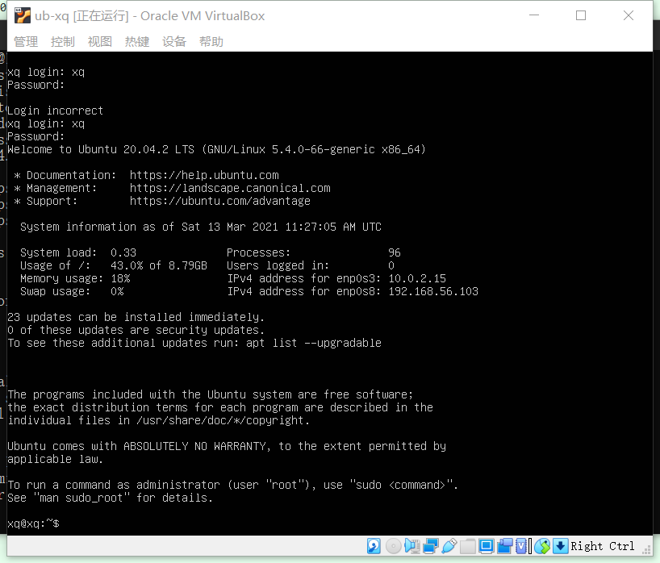
    - - - 
- 在cmd界面ssh刚装好的虚拟机
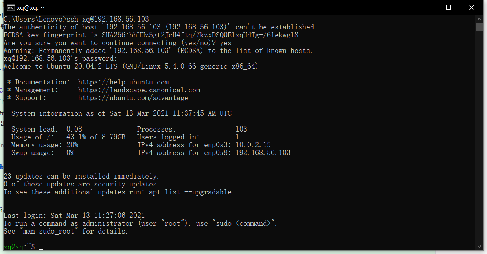
    - - - 
- 切换到root权限并且获取autoinstall-user-data文件
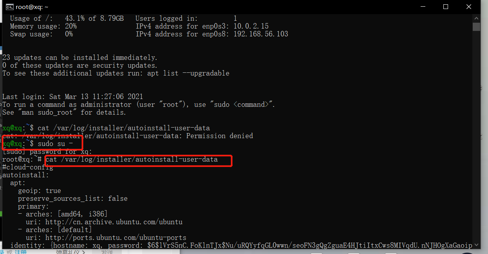
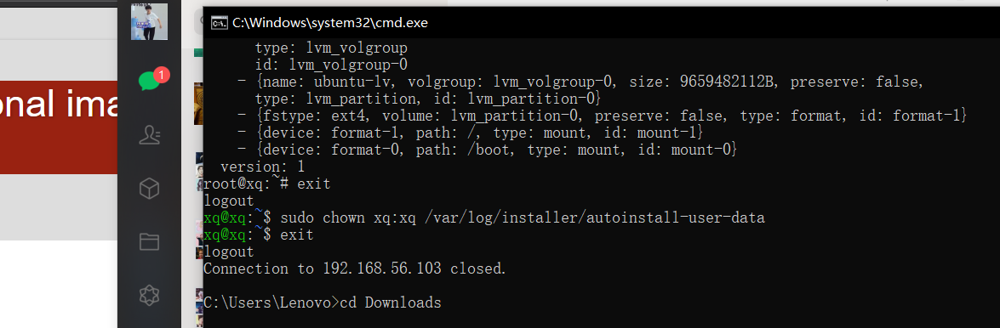
    - - - 
- 对比老师所给的user-data文件修改下载到本地的autoinstall-user-data文件
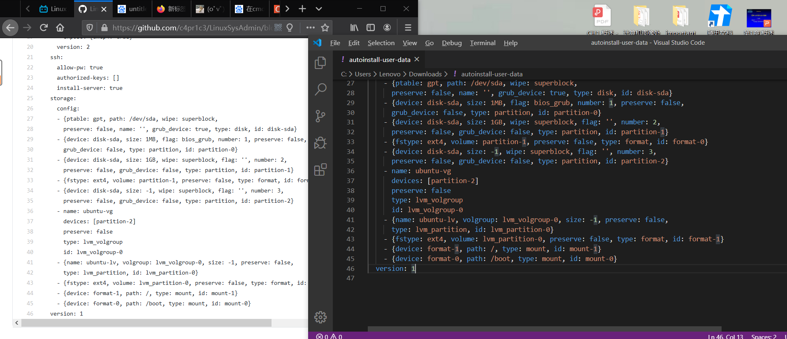
    - - -
- 将改好的autoinstall-user-data文件和新建的meta-data空文件传输到虚拟机中，
**图示前面两步** ：在当前目录下打开Git bush面板输入指令
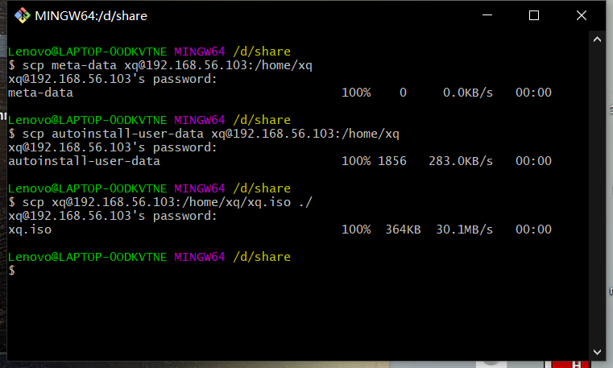
    - - - 
- 下载cloud-image-utils插件并且合成iso文件
- **合成iso文件成功之后记得pwd查看文件所在位置方便物理主机下载到本地**
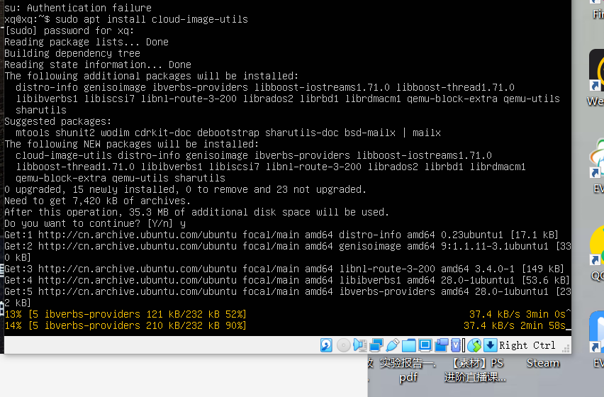
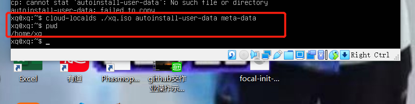
    - - -
- 将生成的iso文件传输下载到本地的目录下
- **下图所示的第三条指令显示传输下载到物理主机的d盘的share文件夹**

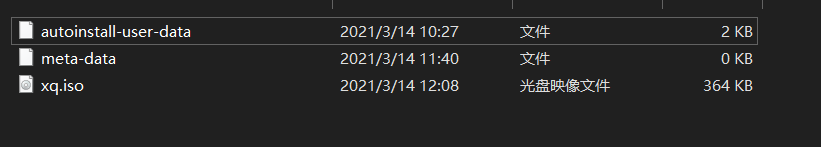
- 挂载生成的iso文件、原本的iso文件，无人值守安装虚拟机
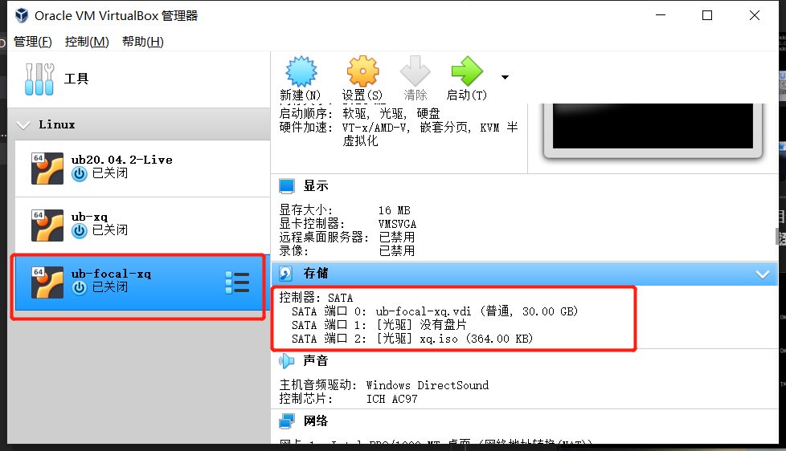
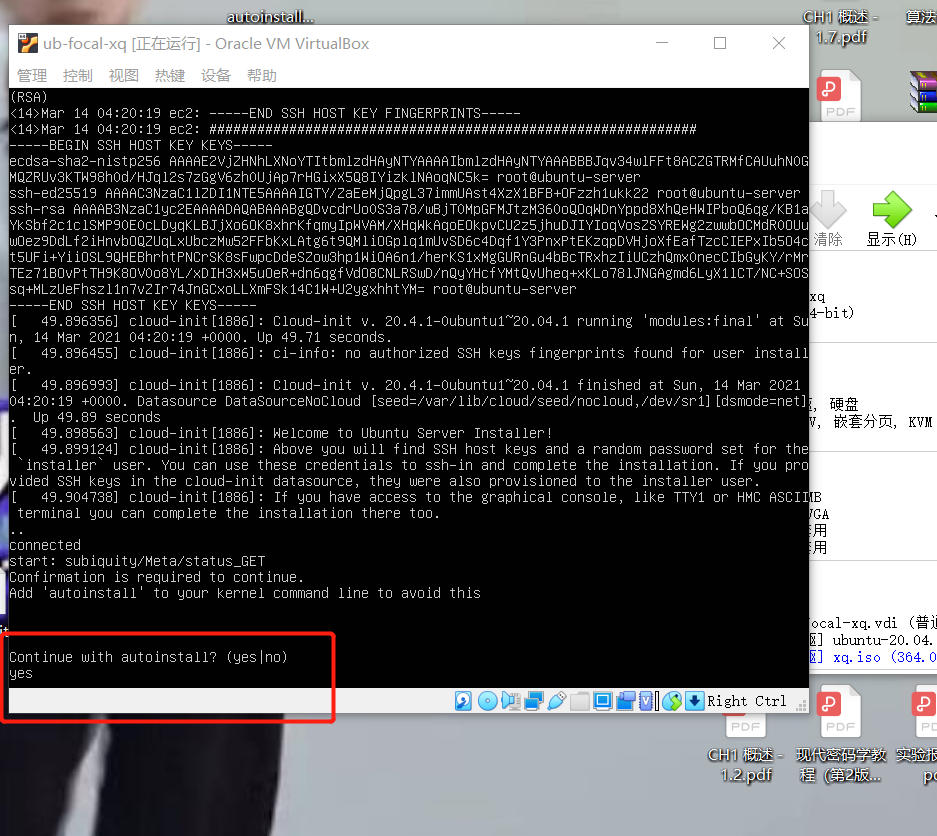
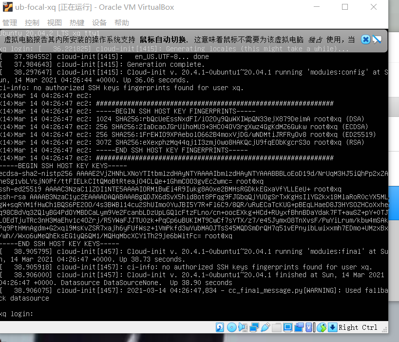
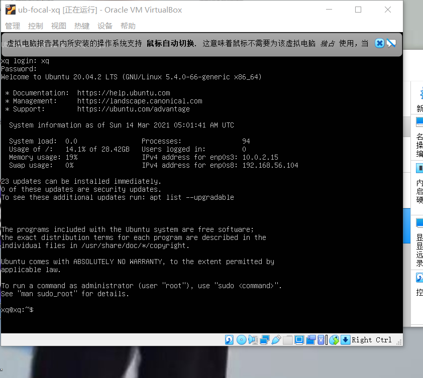
    - - -
- 验证
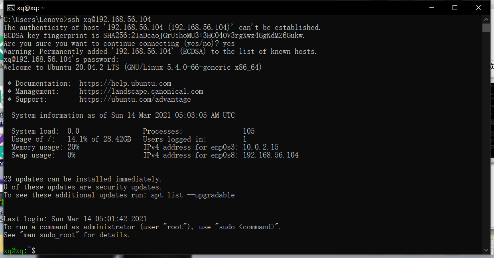
实验完成 喜大普奔
    - - -
### 出现的问题&解决
- 前两次手动安装Ubuntu20.04时无法获取ip地址
    - 解决方式：应该在导入iso文件之前设置双网卡
- 将下载得到的autoinstall-user-data文件传输到虚拟机中还尝试了建立共享文件夹，并在共享文件夹中放入autoinstall-user-data文件和meta-data文件，但是在虚拟机中不能找到相关的文件，合成iso文件无果，查看虚拟机中的共享文件夹需要root权限，需要加强插件等等，学艺不精没有行通
- 刚开始Git bush两个文件到虚拟机中时报错提示不能找到文件
    - 解决方式：在文件所在的目录下Git bush
- 在提问时看到语雀上面的相关提问，所以提前将autoinstall-user-data换源。安装速度变快；
    - 参考链接：http://mirrors.aliyun.com/ubuntu/
https://mirrors.aliyun.com/ubuntu-ports/
- 传输两个文件到虚拟机参考：https://blog.csdn.net/Brave_heart4pzj/article/details/102667985